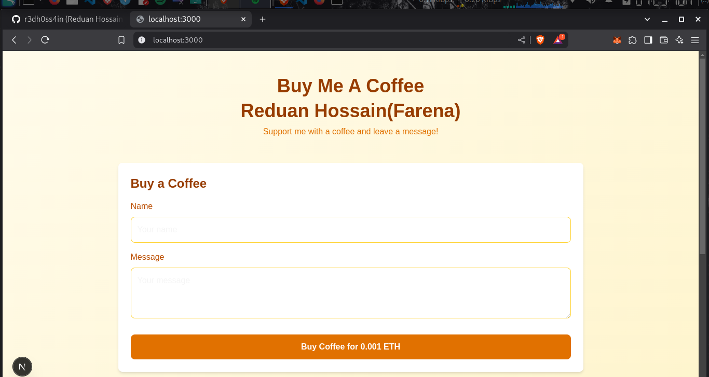
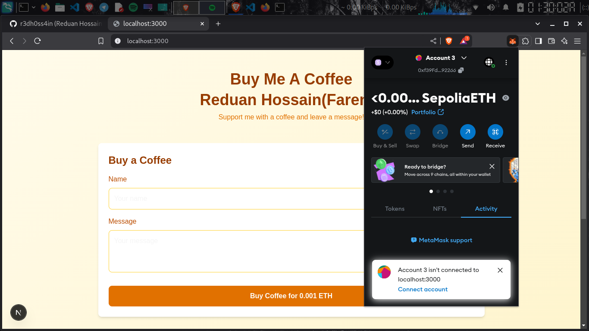
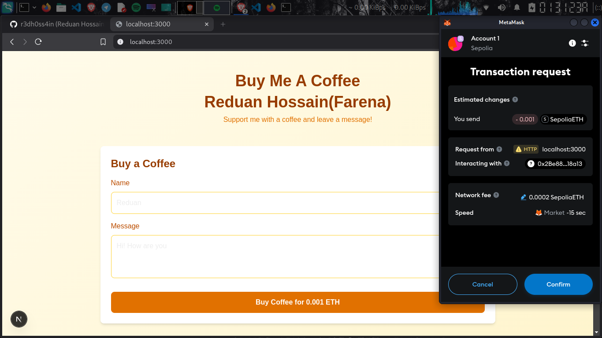
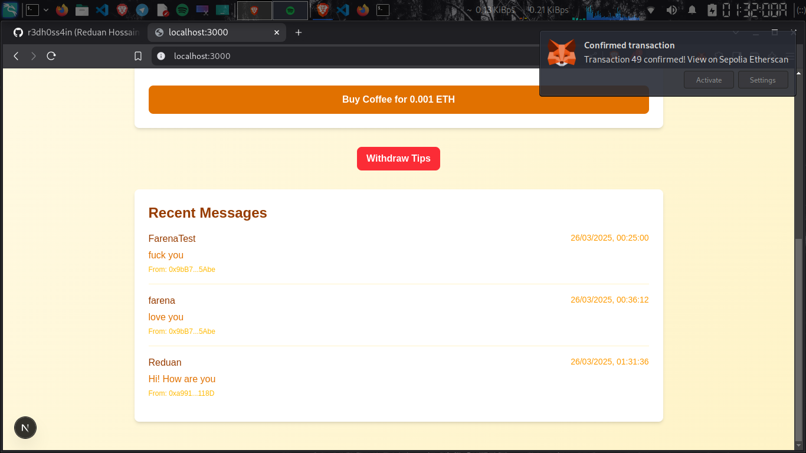

# ☕ Buy Me A Coffee - Web3 DApp  
*A decentralized tipping platform built on Ethereum*

## 👨💻 Created by **Reduan**  






*Screenshot of the dapp interface*

---

## 🌟 Features  
- Send ETH donations with personalized messages  
- Permanent on-chain message storage  
- Withdraw funds anytime (owner only)  

## 📱 Connect With Me  
Let's build together!  

| Platform       | Link                                                                 |
|----------------|----------------------------------------------------------------------|
| 𝕏 Twitter      | [@RedHossain](https://twitter.com/RedHossain)                        |
| 💼 LinkedIn    | [Reduan Hossain](https://www.linkedin.com/in/redhossain/)            |
| 👨💻 GitHub    | [Reduan Hossain](https://github.com/r3dh0ss4in)                      |
| 💻 Medium    | [Reduan Hossain](https://redhossain.medium.com/)                       |

---

## 🛠️ Technical Stack  
```mermaid
graph LR
A[Frontend] -->|Next.js| B(React)
A -->|Ethers.js| C(Blockchain)
D[Backend] -->|Solidity| E(Smart Contracts)
D -->|Hardhat| F(Testing)